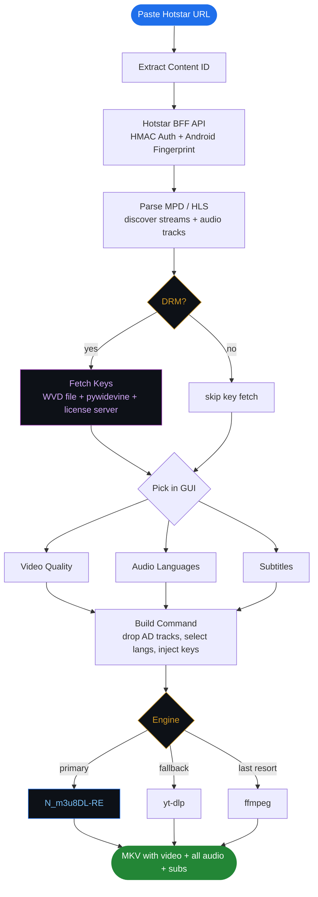

# JioHotstar Downloader

<p align="center">
  <a href="https://github.com/arvind88765/hotstar-downloader/stargazers">
    
  </a>
  <a href="https://github.com/arvind88765/hotstar-downloader/network/members">
    
  </a>
  
  
  
</p>

<p align="center">
  <b>if this saved you time drop a star, takes 1 second</b>
</p>

---

gui app to download jiohotstar content. works on both plain and DRM encrypted streams. picks up all audio languages, drops them in one mkv, handles widevine keys automatically if you have a wvd file.

> disclaimer: personal use only. do not redistribute downloaded content. use at your own risk.

---

## demo


https://github.com/user-attachments/assets/b8782fdc-63cb-48ed-9477-ddd9a3bcbde9


---

## features

- otp login with phone number, no password
- auto detects DRM vs plain, handles both
- widevine L3 key fetch using your own `.wvd` file
- shows all qualities with size before you download
- pick audio languages: hi, te, ta, en, whatever the content has
- auto removes Audio Description dub tracks (no duplicate hindi)
- subtitle download
- filenames like `Dhurandhar_1080p_hi+te+ta_H264_135kbps.mkv`
- status shows Downloading then Muxing then Done
- cancel anytime
- dark gui, no terminal after setup
- N_m3u8DL-RE as primary engine, yt-dlp and ffmpeg as fallback

---

## how it works



---

## what you need

| thing | needed? | notes |
|---|---|---|
| Python 3.9+ | yes | |
| N_m3u8DL-RE | yes | multi-audio only works with this |
| ffmpeg | yes | for muxing |
| `.wvd` device file | yes, for DRM content | without this DRM streams won't decrypt |
| pywidevine | yes, for DRM content | `pip install pywidevine` |
| yt-dlp | optional | auto installs if missing, used as fallback |

---

## setup

### 1. python

[python.org/downloads](https://www.python.org/downloads/) -- tick "Add Python to PATH" during install

```
python --version
```

### 2. clone

```bash
git clone https://github.com/arvind88765/hotstar-downloader.git
cd hotstar-downloader
```

### 3. install deps

```bash
pip install -r requirements.txt
```

### 4. ffmpeg

download from [gyan.dev/ffmpeg/builds](https://www.gyan.dev/ffmpeg/builds/), grab `ffmpeg-release-full.7z`, extract it, add the `bin` folder to PATH. or just paste the full path in Settings.

### 5. N_m3u8DL-RE

go to [github.com/nilaoda/N_m3u8DL-RE/releases](https://github.com/nilaoda/N_m3u8DL-RE/releases), grab `N_m3u8DL-RE_Beta_win-x64.zip`, pull out the exe, paste its path in Settings.

multi-audio only works with this. yt-dlp and ffmpeg are backups. on a 90 mbps connection a 1hr episode takes like 20 seconds with N_m3u8DL-RE vs 3+ minutes with ffmpeg alone.

### 6. WVD device file (mandatory for DRM content)

this is the most important part if you want to download DRM encrypted streams.

a `.wvd` file is a widevine L3 software CDM device. the app uses it to talk to hotstar's license server and get decryption keys. without it, DRM content downloads but stays encrypted and won't play.

**set it up:**
1. put your `.wvd` file somewhere (e.g. `E:\device.wvd`)
2. open the app, go to Settings
3. paste the path in the WVD Device File field
4. save

keys are fetched fresh every download using your login token. nothing is stored.

---

## how to use

```bash
python hotstar_gui.py
```

**Login tab** -- enter phone (no +91), get OTP, login. token lasts about 20 hours.

**Download tab**
1. paste url or content id, hit Fetch Qualities
2. check the DRM status bar:
   - 🔓 plain stream -- download directly
   - 🔒 widevine encrypted -- click Fetch Keys first (needs wvd set up in Settings)
   - 🔑 keys ready -- good
3. pick quality, audio languages, subs
4. set output folder, hit Download

**Settings tab** -- paths for ffmpeg, N_m3u8DL-RE, WVD file, thread count, engine choice.

---

## supported urls

```
https://www.hotstar.com/in/shows/mirzapur/1260022930/episode-name/1260025525/watch
https://www.hotstar.com/in/movies/dhurandhar/1271642559/watch
1271642559
```

---

## filenames

```
Dhurandhar_1080p_hi+te+ta_H264_135kbps.mkv
Mirzapur_S02E04_720p_hi+te_H264_128kbps.mkv
```

format: `Title_Quality_Langs_Codec_AudioBitrate.mkv`

---

## speed

| engine | speed (90 mbps) | multi-audio | DRM |
|---|---|---|---|
| N_m3u8DL-RE | 10-20 sec/ep | yes | yes, inline |
| yt-dlp | 20-40 sec/ep | limited | no |
| ffmpeg | 3-5 min/ep | no | no |

---

## troubleshooting

**"no valid token"** -- login again

**only shows "Best available (auto)"** -- MPD fetch failed, hit Fetch Qualities again

**DRM content plays garbled** -- key fetch failed or wrong wvd file

**Fetch Keys greyed out** -- content has no DRM, just download

**"Key fetch failed"** -- wvd might be revoked or path is wrong in Settings

**only English audio on plain streams** -- hit Fetch Qualities again, app parses both MPD and HLS playlist so all tracks should show up

**really slow download** -- N_m3u8DL-RE not configured. open Settings, paste the path, save.

**OTP not arriving** -- wait 60 seconds, click Resend OTP

---

## files

```
hotstar_gui.py    run this
requirements.txt      pip install -r this
```

token and config auto-created on first run, gitignored so they never get committed.

---

made by **Rvind**
